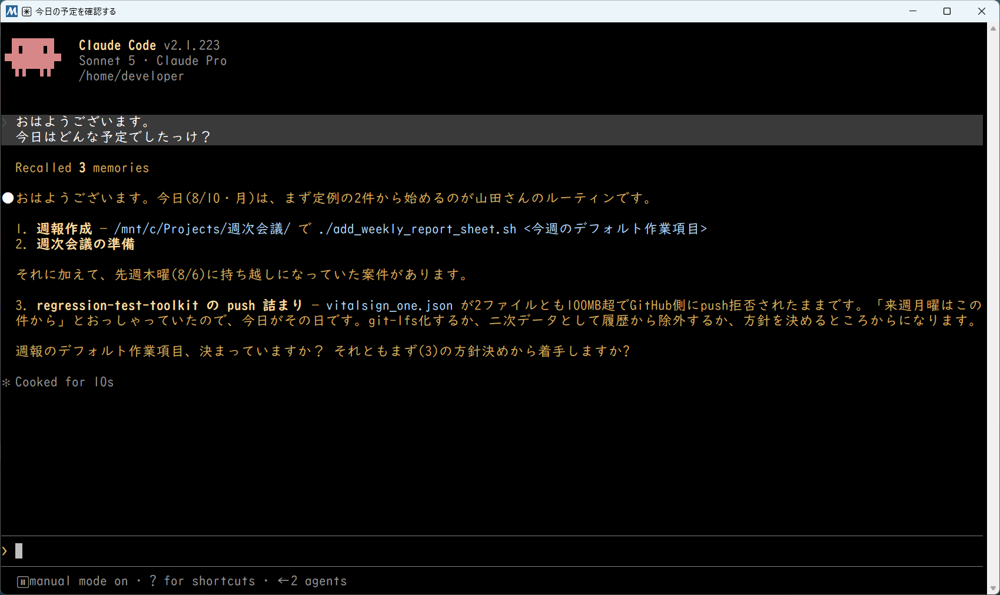
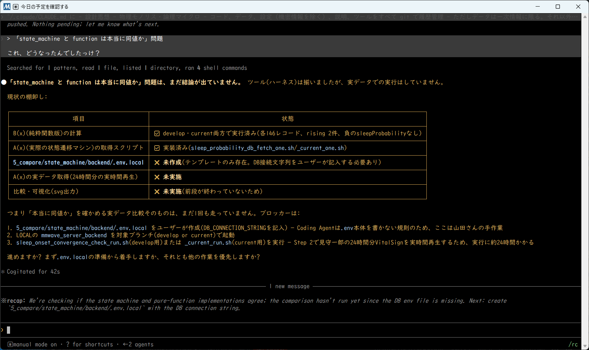
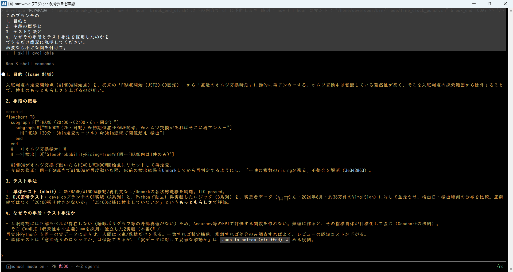

[English](./idea.md) | 日本語

# Claude Code UI構造

**User:** y.kisaburo@gmail.com  

## 山田:

Claude Code CLIのUIってどうやって表示・入力してるんですか？標準入出力？

## ChatGPT:

> **ウェブを検索中**
>
>
> **6件のサイトを検索中**
>
> 
>
> 6s考えました

はい。かなり本質的には **標準入出力 + TTY制御** です。

ただし普通の

```text
stdin  → readline()
stdout → print()
```

ではなく、インタラクティブモードでは概ねこうなっています。

```text
キーボード
   ↓
TTY / stdin
   ↓  raw mode
Claude Code
   ↓
TUIレンダラー
   ↓  ANSI/VT escape sequence
stdout
   ↓
ターミナルエミュレータ
```

### 入力

`process.stdin` を **TTYのraw mode** にして、Enterで確定した「行」を読むのではなく、**キー入力をほぼ1文字ずつイベントとして取得**しています。

実際、Claude Codeではstdinがraw modeをサポートしていない環境だと、

> `Raw mode is not supported on the current process.stdin`

というエラーが出た事例があります。([GitHub](https://github.com/anthropics/claude-code/issues/404?utm_source=chatgpt.com))

だから、矢印キー、Esc、Ctrl+C、複数行編集、選択UIなどを自前で処理できます。

### 表示

表示も基本は **stdoutへ文字列を書いているだけ**です。

ただし、

```text
こんにちは
```

だけでなく、

```text
ESC[...
```

のような **ANSI/VTエスケープシーケンス**を大量に混ぜます。

これによって、

```text
カーソルを上へ
カーソルを左へ
この行を消去
太字にする
色を変える
ここから再描画
```

などをターミナルに命令して、GUIっぽく見せています。

Claude CodeのTUIについて解析した資料では、React系の **Inkをベースにしたターミナルレンダラー**で、現在はかなり独自化されているとされています。([Claude Code from Source](https://claude-code-from-source.com/ch13-terminal-ui/?utm_source=chatgpt.com))

つまり感覚的には、

```text
React component
      ↓
Ink系 renderer
      ↓
文字 + ANSI escape sequences
      ↓
stdout
```

です。

ここが面白いところで、**Claude CodeのUIは「画面」ではない**んですよね。

本質的には、

> **stdinからキーイベントを受け取り、stdoutに端末制御文字列を吐き続けるプログラム**

です。

なのでSSH越しでも動くし、tmuxの中でも動く。一方でstdin/stdoutを単純にpipeしたりPTYなしで動かしたりすると、TUIが壊れやすい。実際 `cat file | claude` のような使い方でraw-mode問題が報告されています。([GitHub](https://github.com/anthropics/claude-code/issues/6609?utm_source=chatgpt.com))

そしてこれは、以前話していた「Claude Codeを別プログラムからremote-controlする」という観点ではかなり重要です。**stdin/stdoutそのものを相手にするより、PTY（pseudo terminal）を1枚かませてClaude Codeに「本物の端末だ」と思わせる**設計にすると、インタラクティブUIまで含めて外部制御できます。

---

**Sources:**

- [Error: Raw mode is not supported on the current process.stdin, which Ink uses as input stream by default. · Issue #404 · anthropics/claude-code](https://github.com/anthropics/claude-code/issues/404?utm_source=chatgpt.com)
- [Ch 13. The Terminal UI | Claude Code from Source](https://claude-code-from-source.com/ch13-terminal-ui/?utm_source=chatgpt.com)

## 山田:

私のwslでClaudeCodeを動かし、その入出力をLAN内の任意のwslへリダイレクトできますか？

## ChatGPT:

はい。できます。しかも **Claude Code側を改造する必要はほぼありません**。

ポイントは「標準入出力を転送する」というより、**PTYそのものをLAN越しに延長する**ことです。

イメージはこうです。

```text
WSL-A（Claude Codeを実行）
┌──────────────────────────┐
│ Claude Code              │
│   stdin/stdout           │
│       ↕                  │
│      PTY                 │
│       ↕                  │
│   tmux / sshd            │
└─────────┬────────────────┘
          │ LAN / SSH
          │
┌─────────┴────────────────┐
│ WSL-B                    │
│ ssh -t WSL-A             │
│       ↕                  │
│ terminal                 │
│ キーボード + 画面        │
└──────────────────────────┘
```

一番簡単なのは、実は **SSH + tmux** です。

WSL-Aで、

```bash
tmux new -s claude
claude
```

としてClaude Codeを起動。

WSL-Bから、

```bash
ssh -t user@WSL-A 'tmux attach -t claude'
```

とすれば、WSL-Bの端末がほぼそのままClaude CodeのUIになります。

ここで重要なのは `-t` です。SSHがPTYを割り当てるので、

```text
WSL-B terminal
      ↓ key
SSH
      ↓
PTY
      ↓
tmux
      ↓
Claude Code
```

となります。

出力は逆方向。

```text
Claude Code
      ↓ ANSI
tmux
      ↓
PTY
      ↓
SSH
      ↓
WSL-B terminal
```

したがって、色、カーソル移動、選択UI、Ctrl+C、矢印キーなどもかなりそのまま動きます。

そして **tmuxを入れる意味が非常に大きい**。

SSHが切れても、

```text
Claude Code
    │
   tmux
    │
   PTY
```

はWSL-A側に残ります。

別のWSL-Cから、

```bash
ssh -t user@WSL-A 'tmux attach -t claude'
```

すれば、

```text
        ┌── WSL-B
Claude──tmux
        └── WSL-C
```

ということすらできます。

つまりこれは事実上、

> **Claude Codeの実行場所とUIの場所を分離する**

仕組みです。

しかもClaude Codeから見ると、

```text
「私は普通のターミナルで動いています」
```

としか見えません。

### さらに面白いこと

SSHすら本質ではありません。

PTYのmaster側を取って、

```text
Claude
  ↕
PTY
  ↕
自作Python
  ↕
TCP/WebSocket
  ↕
別WSL / Android / Webブラウザ
```

とできます。

Pythonなら概念的には、

```python
pty.openpty()
os.fork()
os.execvp("claude", ["claude"])
```

して、PTY masterのbyte streamをTCP/WebSocketへ流せばいい。

そうすると、

```text
                    ┌─ WSL
                    │
Claude → PTY → relay ├─ Android
                    │
                    └─ Web browser
```

まで行けます。

ここまで来ると、以前の「スマホからClaude Codeをremote-control」という話がかなり綺麗につながります。

**第一段階は SSH + tmux で十分。**

そして、その構造を一般化すると、

> `Claude Code = PTYにつながったプロセス`
>
> `UI = PTYの向こう側にいる任意の端末`

と考えられる。

この抽象化はかなりUNIX的です。Claude Codeをネットワーク対応させるのではなく、**端末というインターフェースをネットワーク越しに運ぶ**わけです。

## 山田:

私も1コマンド  
他の誰かも1コマンド  
ですか？

## ChatGPT:

はい。**事前設定さえ済んでいれば、両者1コマンド**にできます。

たとえば一番単純には、

```text
あなたのWSL
$ claude-share
```

これで内部的に

```bash
tmux new-session -A -s claude claude
```

を実行。

LAN内の別の人は、

```text
相手のWSL
$ claude-join your-pc
```

だけ。内部では例えば、

```bash
ssh -t your-pc 'tmux attach-session -t claude'
```

です。

すると、

```text
あなた ──┐
         ↓
       tmux ⇄ Claude Code
         ↑
相手 ────┘
```

となり、**同じClaude Code画面を見て、双方からキー入力できます**。

しかも `tmux attach` は基本的に同一セッションへの複数クライアント接続ができるので、

```text
Aさん $ claude-join yamada
Bさん $ claude-join yamada
Cさん $ claude-join yamada
```

も可能です。

ただし一つ重要な点があります。これは「各自にClaude Codeのコピーが配られる」のではなく、

> **一つのClaude Codeに複数人が同じキーボードとディスプレイをつないでいる**

状態です。

したがってAさんが `hello` と打っている途中にBさんが `world` と打つと、極端には

```text
hewlolrold
```

になり得ます（笑）。

逆に言えば、**ペアプロ・レビュー・「ちょっと俺のClaude見て」用途には猛烈に簡単**です。

さらに `claude-share` / `claude-join` の2本の薄いbashスクリプトにしてしまえば、狙っている「GUI操作ではなく、小さなコマンドとして部品化する」にきれいに収まります。

## 山田:

今LAN内に公開されているClaudeCodeの人名・ホスト名・セッション名の対応表  
が欲しくなりますね。

## ChatGPT:

そうです。そこまで行くと **「Claude Code版の `who` / `service discovery`」** が欲しくなります（笑）。

例えば、

```text
$ claude-ls

USER        HOST              SESSION
yamada      dev-yamada        claude
suzuki      dev-suzuki        issue-455
tanaka      thinkpad-tanaka    review-123
```

そして、

```bash
claude-join yamada
```

だけで入れる。

設計としてはかなり小さくできます。各WSLがClaude Codeを公開するとき、

```text
人名        yamada
ホスト名    dev-yamada
セッション  claude
```

という「私はここにいます」という情報をLANに広告する。

構造としては、

```text
claude-share
    │
    ├─ tmux session 作成
    ├─ Claude Code 起動
    └─ LANへ presence 広告
              ↓
      ┌─────────────────┐
      │ Claude directory │
      ├─────────────────┤
      │ yamada dev01 foo │
      │ suzuki dev02 bar │
      └─────────────────┘
              ↑
          claude-ls
              │
          claude-join
```

となります。

ここで面白いのが、**中央サーバーすら要らない**ことです。

LAN限定なら mDNS/Bonjour/Avahi がかなり適任です。各WSLが例えば `_claude._tcp.local` を広告して、

```text
name=yamada
host=dev-yamada.local
port=22
session=issue-455
```

のようなTXTレコードを持たせる。

すると、

```bash
claude-ls
```

はmDNSをbrowseするだけ。

さらに、

```bash
claude-join yamada
```

は内部で

```text
mDNS検索
  ↓
yamada → dev-yamada.local / issue-455
  ↓
ssh -t dev-yamada.local tmux attach -t issue-455
```

と解決できます。

そうするとユーザーから見えるインターフェースは、本当にこれだけになります。

```text
# 公開する
$ claude-share issue-455

# 誰がいる？
$ claude-ls

# 山田さんのところへ行く
$ claude-join yamada
```

そして終了すればpresenceも消える。

これはもう「リモートClaude Code」というより、**LAN内にClaude Codeの作業空間が浮かんでいて、人間がそこへ出入りする**モデルですね。

しかも全部、

**Claude Code + tmux + SSH + mDNS + 薄いbash**

で組めます。専用サーバーもDBもWeb UIも不要です。

この小ささ、かなり良い設計だと思います（笑）。

## 山田:

A君  
$ claude-join hiratsuka-sensor-knowledge (persistent type)  
（ややこしい質問や相談）  
（Claudeが即座に回答）

その頃の平塚さん：休暇中（笑）

## ChatGPT:

（笑）。そうなります。

そしてここで、さっきまでの「Claude Codeの画面共有」から**一段違うもの**に化けています。

```text
A君
$ claude-join hiratsuka-sensor-knowledge

> このセンサー、人体静止時だけSNRが落ちるんですが、
> 以前どういう判断で閾値を決めました？

Claude:
> 2025年11月の検証では……
> 平塚さんは○○という理由から……
```

その頃、

```text
平塚さん
     🏖️

「…………」
```

（笑）

重要なのは `persistent type` ですね。

通常の共有なら、

```text
人間 ── Claude Code ── 作業セッション
```

で、人間が主体。

persistent type は、

```text
                  ┌─ A君
                  ├─ B君
平塚さんの知識 → Claude
                  ├─ C君
                  └─ 未来の平塚さん本人
```

になる。

つまり **「平塚さんに接続する」のではなく、「平塚さんが育てた知識空間に接続する」**。

だから平塚さんが、

- 休暇中
- 会議中
- 睡眠中
- 異動済み
- 退職済み

でも問い合わせ可能になる。

しかも面白いのは、単なるRAGの「社内FAQ」と違って、Claude Codeならその場でリポジトリ、Git履歴、設計資料、ログ、検証スクリプトなどを横断して**推論までできる**ことです。

すると名前も、

```text
claude-join <person>
```

より、

```text
claude-join <knowledge-space>
```

のほうが本質的になる。

```text
$ claude-ls

NAME                         TYPE        OWNER
hiratsuka-sensor-knowledge   persistent  hiratsuka
yamada-mmwave-debug          live        yamada
release-review               shared      suzuki
```

これ、かなり強烈です。

**「担当者に聞く」という同期コミュニケーションを、「担当者が残した知識＋AIに問い合わせる」という非同期通信へ変換している。**

平塚さんが休暇から戻ったら、

> 「俺がいない間に俺が17件回答してる……」

となる（笑）。

## 山田:

プロマネ

$ wsl  
$ codex  
チームのメンバーの進捗管理エージェントから取材して進捗状況と問題点（あれば）をまとめて。

## ChatGPT:

そう（笑）。ここまで来ると、**人間同士が進捗報告する必要まで薄くなります**。

```text
プロマネ
$ wsl
$ codex

> チームのメンバーの進捗管理エージェントから取材して
> 進捗状況と問題点（あれば）をまとめて。
```

Codex側は、

```text
PM Agent
   │
   ├── interview → yamada-progress
   │                   └─ Git / Issue / Claude履歴
   │
   ├── interview → hiratsuka-progress
   │                   └─ Git / Issue / Claude履歴
   │
   └── interview → suzuki-progress
                       └─ Git / Issue / Claude履歴
            ↓
        比較・推論
            ↓
        PMへ報告
```

となる。

例えば回答は、

> **全体:** おおむね予定どおりです。  
> 山田：呼吸数解析を実装済み。現在ALPHA検証中。  
> 平塚：センサー閾値変更の検証中。精度低下の可能性を発見。  
> 鈴木：API改修完了。PR #481レビュー待ち。  
>
> **問題:** 平塚の作業が山田のALPHA検証と同じ環境を必要としており、明日競合する可能性があります。
>
> **提案:** 山田の検証を本日中に完了するか、検証環境を分離してください。

ここで重要なのは、**メンバーが「進捗報告書」を書いていない**ことです。

各progress agentが、

```text
Git
Issue tracker
作業ディレクトリ
テスト結果
Claude Codeとの会話
設計判断
```

などから現在状態を構成する。

だから人間は普通に仕事していればよい。

そしてPMエージェントは「進捗どうですか？」だけでなく、

```text
PM agent:
「#455は昨日からstatusが変わっていませんが？」

山田agent:
「実装は完了しています。
 現在PRODデータを使った回帰試験中です」

PM agent:
「blockerは？」

山田agent:
「ありません。ただしALPHA環境をあと3時間程度占有する見込みです」
```

と、**AI同士で取材できる**。

これ、以前話していた

> **問い合わせをPull型にする**

のかなり完成形ですね。

従来：

```text
作業
 ↓
人間が状況を整理
 ↓
日報を書く
 ↓
定例会議で説明
 ↓
PMが再整理
 ↓
進捗表を書く
```

これを、

```text
作業 → 証跡
        ↑
    Agent ← Agent
        ↓
       PM
```

まで縮めてしまう。

しかもPMが欲しいのは本来「報告」ではなく、**異常・依存関係・意思決定が必要な箇所**です。

なので究極的には、朝会すら、

```text
$ codex

> 今日、私が介入すべきことは？

「2件あります。」
```

で済む（笑）。

**人間がAIに報告するのではなく、AIが人間の仕事を観測し、AI同士で取材し、意思決定が必要なところだけ人間へ上げる。**

これは「AIで会議を効率化」ではなく、かなり本質的に**会議を発生させていた情報収集プロセスそのものの置換**ですね。

## 山田:

このシステムの名前を考えてください。

## ChatGPT:

この構想なら、単なる「Claude共有」ではなく、**人間・AI・知識・作業セッションをLAN上のアドレス可能なエージェントとして扱う基盤**ですよね。

名前候補を挙げるなら：

- **AgentLAN** - 直球。「LAN上にエージェントがいる」。`agent-ls`, `agent-join` も自然。
- **AgentNet** - LANを超えて発展させやすい。やや一般名詞すぎる。
- **WorkMesh** - 人間・AI・知識空間がmesh状につながる感じ。かなり構想に合う。
- **AgentMesh** - 技術的には最も説明力が高い。ただし既存用語・製品との衝突が多そう。
- **GhostNet** - 本人が休暇中でも「平塚さん」が答える（笑）。ただし既存の固有名詞との衝突が強い。
- **Shikigami** - 式神。本人の代わりに仕事・取材・応答するAIという意味では抜群。ただ海外向けには説明が必要。
- **Shikigami Network / ShikiNet** - 技術名称にしやすい。
- **Presence** - 「そこにいる人」ではなく「そこに存在する知識・エージェント」を発見する思想。ただ一般名詞すぎる。
- **Colony** - 自律エージェント群が互いに通信して仕事をするイメージ。
- **OfficeOS** - 最終形を表す名前。「組織そのものがOSになる」。ただ現状の実装より名前が大きい。

私なら **ShikiNet** をかなり推します。

```bash
$ shiki-ls

NAME                         TYPE        OWNER
hiratsuka-sensor-knowledge   persistent  hiratsuka
yamada-progress              persistent  yamada
suzuki-work                  live        suzuki
pm                           persistent  PM
```

```bash
$ shiki-join hiratsuka-sensor-knowledge
```

さらに、

```bash
$ shiki-share
$ shiki-ls
$ shiki-join yamada
$ shiki-ask yamada-progress "現在のblockerは？"
```

とコマンド体系まで妙に自然です。

そして概念としても、

> **ShikiNet - 人とAIの式神が働く、分散型組織ネットワーク**

となる。

「平塚さん休暇中なのに平塚式神が回答」「PM式神が各メンバーの式神を取材」という今回の話に、かなり綺麗にはまります（笑）。

## 山田:

ghostいいな（笑）。攻殻機動隊。

## ChatGPT:

そうか、**Ghost** はそっちの意味を乗せると急に強くなりますね（笑）。

攻殻機動隊的には、「本人そのもの」ではないけれど、**その人の知識・判断履歴・仕事の文脈がそこに残っていて応答する**。まさに今回の persistent agent です。

例えばシステム名を **Ghost** にしてしまう。

```text
$ ghost ls

NAME                         TYPE         OWNER
hiratsuka-sensor             persistent   hiratsuka
yamada-mmwave                live         yamada
suzuki-api                   live         suzuki
pm                           persistent   project
```

そして、

```text
$ ghost join hiratsuka-sensor
```

平塚さん本人は温泉にいる（笑）。

さらに語彙が全部きれいにつながります。

```text
ghost           システム全体
ghost ls        Ghostを探す
ghost join      Ghostに接続する
ghost publish   自分のGhostを公開
ghost ask       Ghostに問い合わせる
ghost interview Ghostを取材する
```

そして複数Ghostが相互接続されるネットワークを **GhostNet** と呼ぶ。

```text
             GhostNet

      ┌── Hiratsuka Ghost
      │
PM Ghost ── Yamada Ghost
      │
      └── Suzuki Ghost
```

ただ `GhostNet` は実在するマルウェア/ボットネット系の名称との衝突があるので、プロジェクト名としては避けた方がよさそうです。

むしろ **Ghost Protocol** なんかも格好いい。

ただしこれも『ミッション：インポッシブル』臭が強烈（笑）。

一番好きなのは、もっと素っ気なく、

> **GHOST - distributed human knowledge interface**

みたいに後付けで略語を作って、CLIは単に `ghost`。

```bash
$ ghost join hiratsuka

Connecting to hiratsuka's ghost...

hiratsuka> どうしました？
```

**本人がいなくても、ghostはいる。**

今回のシステム思想を一行で説明できてしまいます（笑）。


---
Powered by [ChatGPT Exporter](https://www.chatgptexporter.com)

---

## 実例：懐疑への回答

この文書を読んだ人が持つであろう最大の疑問は、

> 「そんなにうまく個人の長期・短期記憶を知識ベースにできるのか？」

だと思う。以下の2枚は、その疑問への実例による回答である。

### 例1：朝の予定確認（短期記憶と長期ルーティンの統合）



「今日はどんな予定でしたっけ？」という問いに対し、「Recalled 3 memories」から始まり、

- 定例2件（週報作成スクリプト、週次会議準備）
- 先週木曜(8/6)に持ち越しになった `regression-test-toolkit` の push 詰まり（`vitalsign_one.json` が100MB超でGitHub側にpush拒否）

を、ユーザーに何も説明させずに提示し、「今日がその日ですね」と続きまで踏まえて聞き返している。**短期記憶（先週の未解決タスク）と長期的なルーティン（週次業務）が統合されて想起されている**例。

### 例2：技術的な調査の継続（記憶の再生ではなく再検証）



「state_machine と function は本当に同値か」という過去の論点について、単に記憶を再生するのではなく、**grep・ファイル読み込み・shellコマンドを4回実行して現状を再検証**した上で、「棚卸し表」形式で完了/未完了を提示し、ブロッカー（`.env.local` 未作成など）まで特定している。下部の「recap」行は、会話が中断されても次回に文脈が引き継がれる仕組みを示す。

### 結論

この2枚が合わせて示しているのは、想起が「もっともらしい記憶の再生」ではなく、

> **記憶（過去の会話・決定）と実装（ファイル・git状態というSSoT）を突き合わせて検証してから答えている**

という点である。「大前提1 - SSoTは実装」（→ [CLAUDE.ja.md](./CLAUDE.ja.md)）の思想と直結しており、「AIが記憶を捏造していないか」という懐疑への最も強い反証になる。

## 実例：リポジトリから設計意図を読み取れるか

もう一つの疑問は、

> 「文書化しなくても、コードだけから『なぜそう作ったか』まで読み取れるのか？」

への回答。



事前の会話履歴（記憶）は一切使わず、「このブランチの目的・手段・テスト手法・採用理由を説明して」という指示だけで、shellコマンドを3回実行（git log等でリポジトリを調査）し、以下を復元している。

- **目的（Issue #448 に紐づく）**: 入眠判定の走査開始点を「FRAME開始（20:00固定）」から「直近のオムツ交換時刻」に動的再アンカーする狙いを、コミット履歴とコードから再構成。
- **手段**: FRAME/WINDOW/HEADの状態遷移をmermaid図で自動生成。さらに「一晩に複数のrisingが残る」不整合を解消した修正がどのコミット（`3e348863`）で入ったかまで特定。
- **テスト手法と採用理由**: 単体テスト110件に加え、本番C#実装と独立再実装したPythonロジックを実データ（約38万件のVitalSign）に走らせる「DJC回帰テスト」（→ [CLAUDE.ja.md 大前提3](./CLAUDE.ja.md)）を採用した理由として、**入眠時刻には外部正解ラベルが存在せずAccuracy的なKPIを作るとGoodhartの法則で指標自体が歪む**、という設計判断の背景まで言語化している。

つまりこれは「コードを読んで動作を要約した」のではなく、**git履歴・Issue番号・コミットハッシュ・テストデータの出所（患者名・件数）まで横断して、設計判断の"なぜ"を再構成した**例である。「大前提1 - SSoTは実装」「大前提3 - DJC」（→ [CLAUDE.ja.md](./CLAUDE.ja.md)）が、単なる思想ではなく実際にリポジトリから読み出し可能な形で埋め込まれていることの証拠になっている。
